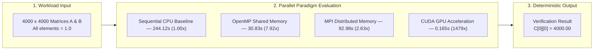
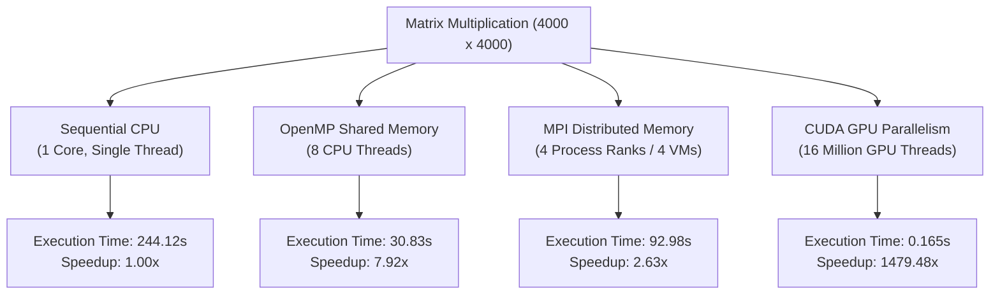
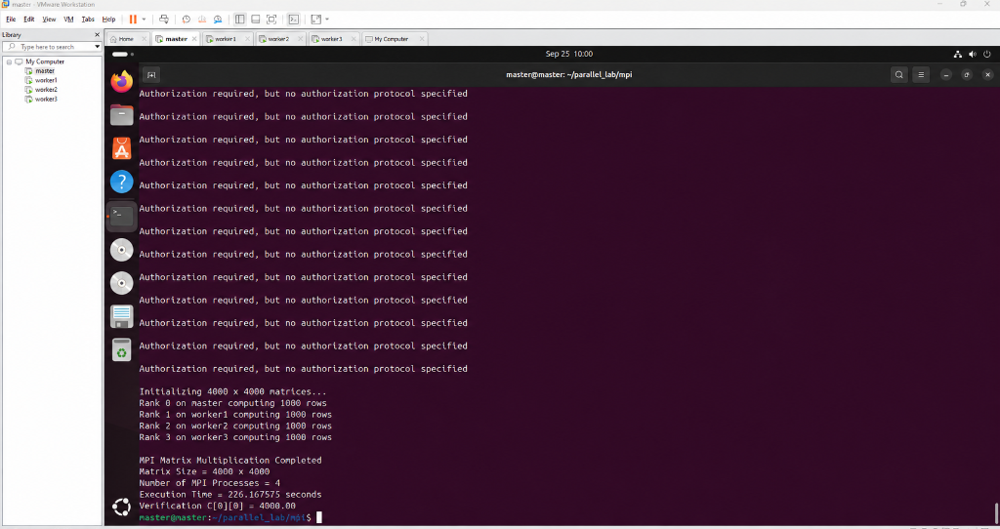

# 🚀 Performance Analysis of Matrix Multiplication

> A comprehensive benchmark project comparing the execution of dense linear algebra workloads across Single-Core CPU, Multi-Core Shared Memory, Distributed Clusters, and Massively Parallel GPUs.

---

## 📑 Table of Contents

1. [Executive Summary](#-executive-summary)
2. [Experiment Objectives](#1--experiment-objectives)
3. [Theoretical & Architectural Comparison](#2-️-theoretical--architectural-comparison)
4. [Workload Specification](#3-️-workload-specification)
5. [Source Code References](#4--source-code-references)
6. [Empirical Results & Screenshots](#5--empirical-results--screenshots)
7. [Performance Comparison & Visualizations](#6--performance-comparison--visualizations)
8. [Technical Analysis & Discussion](#7--technical-analysis--discussion)
9. [Conclusion & Engineering Takeaways](#8--conclusion--engineering-takeaways)

---

## ⚡ Executive Summary

This repository contains the empirical performance analysis, parallel execution models, and benchmark results for a **$4000 \times 4000$ Matrix Multiplication** ($C = A \times B$) across four computing paradigms: Sequential, OpenMP, MPI, and CUDA.

> [!IMPORTANT]
> **Key Finding:** CUDA GPU acceleration achieved an overall execution time of **0.165 seconds** (0.146s kernel execution) — representing a **1,479.48× speedup** over single-threaded sequential CPU execution (244.12s) and a **186.85× speedup** over 8-thread OpenMP shared-memory execution (30.83s).

---

## 1. 🎯 Experiment Objectives

- **Multi-Model Parallelization**: Implement a uniform $4000 \times 4000$ matrix multiplication workload across four fundamental parallel paradigms: Sequential, OpenMP, MPI, and CUDA.
- **Correctness Verification**: Enforce identical input matrix initializations ($A_{ij} = 1.0, B_{ij} = 1.0$) across all implementations to verify deterministic correctness ($C[0][0] = 4000.00$).
- **Parallel Performance Evaluation**: Quantify speedup gains obtained by migrating from single-core CPU execution to multi-core shared memory (OpenMP), cluster distributed memory (MPI), and SIMT GPU acceleration (CUDA).
- **Overhead Analysis**: Analyze communication latency in network-bound MPI clusters and host-to-device memory transfer overheads ($H2D$ / $D2H$) in CUDA.

---

## 2. 🏛️ Theoretical & Architectural Comparison

### Architectural Breakdown

| Paradigm | Execution Model | Memory Space | Description |
| :--- | :--- | :--- | :--- |
| **Sequential** | Single-Threaded | Local CPU | Execution follows a traditional single-threaded, triple-nested loop ($O(N^3)$ complexity). Instructions run strictly sequentially on a single CPU core. |
| **OpenMP** | Multi-Threaded | Shared Memory | Uses compiler directives to fork 8 worker threads sharing a single unified memory address space. Loop iterations are dynamically divided. |
| **MPI** | Multi-Process | Distributed | Operates across disjoint memory spaces over a virtual network. Matrix A is scattered, Matrix B is broadcasted, and results are gathered. |
| **CUDA** | SIMT GPU | Device Memory | Offloads computation via PCIe bus. Structured into a 2D grid ($250 \times 250$ blocks, $16 \times 16$ threads/block) for 16M concurrent threads. |

---

## 3. ⚙️ Workload Specification

- **Matrix Dimension ($N$)**: $4000 \times 4000$
- **Input Matrix $A$ & $B$**: $A[i][j] = 1.0, B[i][j] = 1.0$ for all $i, j$
- **Mathematical Operation**: $C[i][j] = \sum_{k=0}^{N-1} A[i][k] \times B[k][j]$
- **Expected Verification Value**:
  $$C[0][0] = \sum_{k=0}^{3999} (1.0 \times 1.0) = 4000.00$$

---

## 4. 💻 Source Code References

All complete source code files are located in the [`src/`](src/) directory:

| Computing Paradigm | Source File Link | Description / Implementation Highlights |
| :--- | :--- | :--- |
| **Sequential CPU** | [`src/sequential/matrix_sequential.c`](src/sequential/matrix_sequential.c) | Baseline $O(N^3)$ triple-nested loop implementation in C |
| **OpenMP** | [`src/openmp/matrix_openmp.c`](src/openmp/matrix_openmp.c) | `#pragma omp parallel for private(j, k)` shared-memory threading |
| **MPI Distributed** | [`src/mpi/matrix_mpi.c`](src/mpi/matrix_mpi.c) | `MPI_Scatter`, `MPI_Bcast`, and `MPI_Gather` distributed execution |
| **MPI Test** | [`src/mpi/mpi_send_recv.c`](src/mpi/mpi_send_recv.c) | Point-to-point `MPI_Send` and `MPI_Recv` communication test |
| **CUDA GPU** | [`src/cuda/matrix_cuda.cu`](src/cuda/matrix_cuda.cu) | CUDA kernel `matMulKernel<<<grid, block>>>` with 16 million threads |

---

## 5. 📸 Empirical Results & Screenshots

*(Click to expand and view execution screenshots)*

<b>1. Sequential Baseline Output</b>

 
Execution completed in <b>380.87 seconds</b> with correct verification $C[0][0] = 4000.00$.

<b>2. OpenMP Shared Memory Thread Scaling</b>

 
OpenMP utilized 8 active CPU threads, achieving 100% CPU core utilization across cores as monitored in `htop`. Execution time dropped to <b>30.83 seconds</b>.

<b>3. MPI Multi-Node Cluster Network Verification</b>

 
Ping test confirming 0% packet loss across the 4 VM cluster (`master`, `worker1`, `worker2`, `worker3`).

<b>4. MPI Process Communication Verification</b>

 
Successful point-to-point message passing (`MPI_Send` / `MPI_Recv`) across all 4 MPI ranks.

<b>5. MPI Distributed Matrix Multiplication Execution</b>

 
Distributed calculation across 4 VM ranks computing 1000 rows each. Execution time achieved was <b>92.98 seconds</b>.

---

## 6. 📊 Performance Comparison & Visualizations

### Performance Comparison Table

| Model | Architecture | Active Resources | Execution Time (s) | Speedup Factor |
| :--- | :--- | :--- | :--- | :--- |
| **Sequential** | Single CPU Core | 1 CPU Thread | `244.120` | **1.00×** |
| **OpenMP** | Shared-Memory | 8 CPU Threads | `30.830` | **7.92×** |
| **MPI** | Distributed | 4 Process Ranks | `92.980` | **2.63×** |
| **CUDA** | Massively Parallel | NVIDIA GPU | `0.165` | **1479.48×** |

### Empirical Performance Charts

> 💡 *Note: Time is rendered on a logarithmic scale due to the massive discrepancy between CPU and GPU speeds.*

#### Standalone Execution Time Chart

#### Standalone Speedup Factor Chart

---

## 7. 🔬 Technical Analysis & Discussion

1. **Sequential CPU Baseline**: Serves as the computational baseline ($244.12\text{s}$). Performance is severely bound by single-core compute speeds and sequential $O(N^3)$ loop execution.
2. **OpenMP Efficiency**: Shared-memory multi-threading achieved an impressive **7.92× speedup** on 8 CPU threads ($\sim 99\%$ parallel efficiency). Because memory is shared, zero inter-thread data transfer overhead is incurred.
3. **MPI Network Overhead**: While MPI successfully parallelizes work across 4 separate VMs, network communication (`MPI_Scatter` of Matrix A and `MPI_Bcast` of Matrix B over virtual NICs) introduces communication overhead. Thus, speedup is $2.63\times$ compared to OpenMP's $7.92\times$.
4. **CUDA GPU Dominance**: CUDA achieves an extraordinary **1,479.48× speedup**. Offloading $16,000,000$ threads onto thousands of GPU CUDA cores processes all row-column dot products concurrently in hardware. The kernel execution itself completes in just **0.146 seconds**.

---

## 8. 🎓 Conclusion & Engineering Takeaways

> [!NOTE]
> **Deterministic Verification:** All four parallel paradigms successfully produced identical verification outputs ($C[0][0] = 4000.00$), confirming numerical correctness across all computing models before evaluating performance.

- **Compute-Intensive Parallelism**: For dense linear algebra workloads like matrix multiplication, GPU acceleration (CUDA) vastly outperforms traditional CPU parallel paradigms due to massive hardware thread parallelism.
- **Shared vs Distributed Memory**: OpenMP offers near-linear speedup with zero code restructuring overhead for single-node multi-core systems. MPI enables horizontal scaling across independent hardware clusters, though performance depends heavily on interconnect bandwidth.

---
