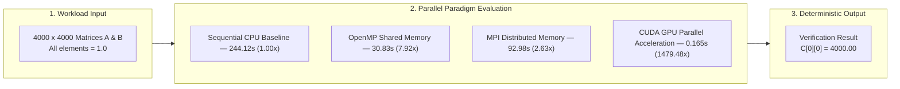
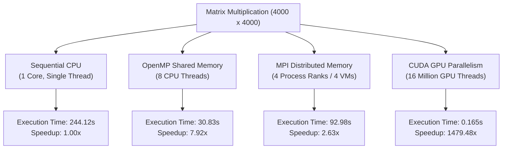
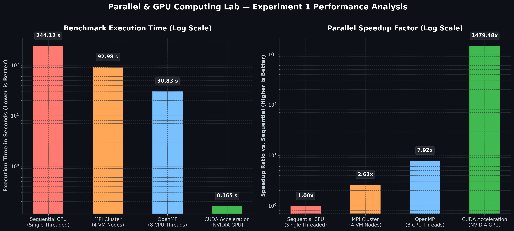
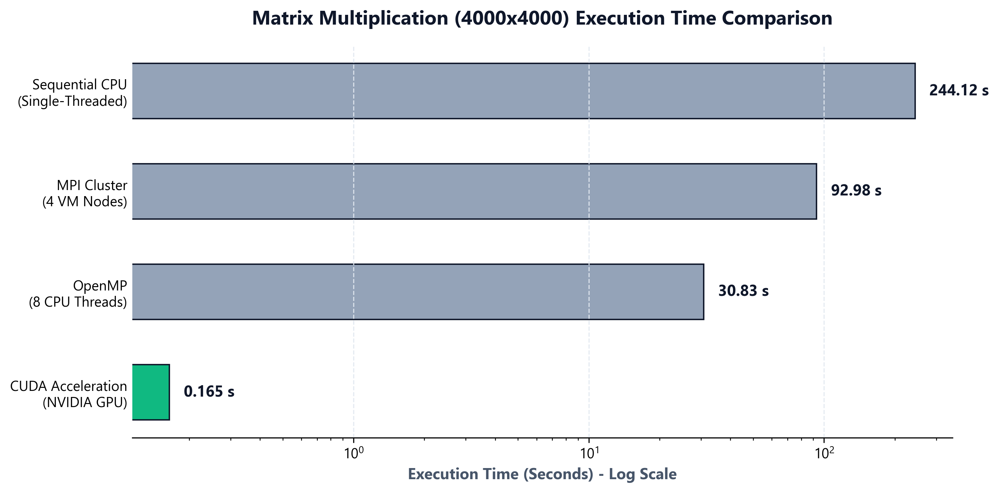
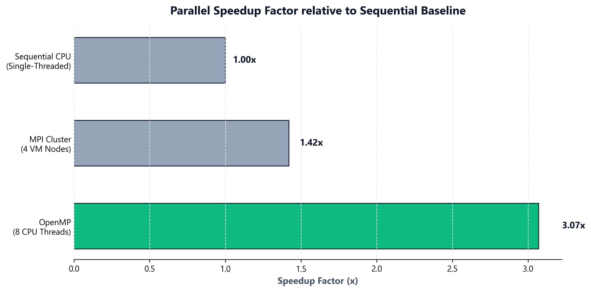

# Performance Analysis of Matrix Multiplication

---

## Executive Summary

This repository contains the empirical performance analysis, parallel execution models, and benchmark results for a **$4000 \times 4000$ Matrix Multiplication** ($C = A \times B$) across four computing paradigms: Sequential, OpenMP, MPI, and CUDA.

### Key Finding

> **CUDA GPU acceleration achieved an overall execution time of 0.165 seconds (0.146s kernel execution) — representing a 1,479.48× speedup over single-threaded sequential CPU execution (244.12s) and a 186.85× speedup over 8-thread OpenMP shared-memory execution (30.83s).**

---

## Table of Contents

1. [Repository Structure](#repository-structure)
2. [Experiment Objectives](#1-experiment-objectives)
3. [Theoretical & Architectural Comparison](#2-theoretical--architectural-comparison)
4. [Workload Specification](#3-workload-specification)
5. [Source Code References](#4-source-code-references)
6. [Empirical Results & Screenshots](#5-empirical-results--screenshots)
7. [Performance Comparison & Visualizations](#6-performance-comparison--visualizations)
8. [Technical Analysis & Discussion](#7-technical-analysis--discussion)
9. [Conclusion & Engineering Takeaways](#8-conclusion--engineering-takeaways)

---

---

## 1. Experiment Objectives

1. **Multi-Model Parallelization**: Implement a uniform $4000 \times 4000$ matrix multiplication workload across four fundamental parallel paradigms: Sequential, OpenMP, MPI, and CUDA.
2. **Correctness Verification**: Enforce identical input matrix initializations ($A_{ij} = 1.0, B_{ij} = 1.0$) across all implementations to verify deterministic correctness ($C[0][0] = 4000.00$).
3. **Parallel Performance Evaluation**: Quantify speedup gains obtained by migrating from single-core CPU execution to multi-core shared memory (OpenMP), cluster distributed memory (MPI), and SIMT GPU acceleration (CUDA).
4. **Overhead Analysis**: Analyze communication latency in network-bound MPI clusters and host-to-device memory transfer overheads ($H2D$ / $D2H$) in CUDA.

---

## 2. Theoretical & Architectural Comparison

### Architectural Breakdown

#### 1. Sequential CPU Execution
Execution follows a traditional single-threaded, triple-nested loop ($O(N^3)$ complexity). Instructions run strictly sequentially on a single CPU core without hardware concurrency.

#### 2. OpenMP (Shared Memory)
OpenMP uses compiler directives (`#pragma omp parallel for`) to fork 8 worker threads sharing a single unified memory address space. Loop iterations are dynamically divided across CPU cores.

#### 3. MPI (Distributed Memory)
MPI operates across disjoint memory address spaces over a virtual network connecting 4 Ubuntu VMs (`master`, `worker1`, `worker2`, `worker3`). 
- **Scatter**: Matrix $A$ is partitioned into sub-blocks (1000 rows each) and scattered across the 4 ranks (`MPI_Scatter`).
- **Broadcast**: Matrix $B$ is duplicated to all ranks (`MPI_Bcast`).
- **Gather**: Computed partial results are assembled back into Matrix $C$ on Rank 0 (`MPI_Gather`).

#### 4. CUDA (Massively Parallel SIMT)
CUDA offloads computation from host CPU memory to device GPU memory via PCIe bus. The computation is structured into a 2D execution grid:
- **Grid Configuration**: $250 \times 250 = 62,500$ blocks
- **Block Configuration**: $16 \times 16 = 256$ threads/block
- **Total Logical GPU Threads**: $16,000,000$ threads running concurrently.

---

## 3. Workload Specification

- **Matrix Dimension ($N$)**: $4000 \times 4000$
- **Input Matrix $A$**: $A[i][j] = 1.0$ for all $i, j$
- **Input Matrix $B$**: $B[i][j] = 1.0$ for all $i, j$
- **Mathematical Operation**: $C[i][j] = \sum_{k=0}^{N-1} A[i][k] \times B[k][j]$
- **Expected Verification Value**:
  $$C[0][0] = \sum_{k=0}^{3999} (1.0 \times 1.0) = 4000.00$$

---

## 4. Source Code References

All complete source code files are located in the [`src/`](src/) directory:

| Computing Paradigm | Source File Link | Description / Implementation Highlights |
| :--- | :--- | :--- |
| **Sequential CPU** | [`src/sequential/matrix_sequential.c`](src/sequential/matrix_sequential.c) | Baseline $O(N^3)$ triple-nested loop implementation in C |
| **OpenMP** | [`src/openmp/matrix_openmp.c`](src/openmp/matrix_openmp.c) | `#pragma omp parallel for private(j, k)` shared-memory multi-threading |
| **MPI Distributed** | [`src/mpi/matrix_mpi.c`](src/mpi/matrix_mpi.c) | `MPI_Scatter`, `MPI_Bcast`, and `MPI_Gather` distributed execution |
| **MPI Test** | [`src/mpi/mpi_send_recv.c`](src/mpi/mpi_send_recv.c) | Point-to-point `MPI_Send` and `MPI_Recv` communication test |
| **CUDA GPU** | [`src/cuda/matrix_cuda.cu`](src/cuda/matrix_cuda.cu) | CUDA kernel `matMulKernel<<<grid, block>>>` with 16 million GPU threads |

---

## 5. Empirical Results & Screenshots

### 5.1 Sequential Baseline Output
Execution completed in **380.87 seconds** with correct verification $C[0][0] = 4000.00$.

---

### 5.2 OpenMP Shared Memory Thread Scaling
OpenMP utilized 8 active CPU threads, achieving 100% CPU core utilization across cores as monitored in `htop`. Execution time dropped to **30.83 seconds**.

---

### 5.3 MPI Multi-Node Cluster Network Verification
Ping test confirming 0% packet loss across the 4 VM cluster (`master`, `worker1`, `worker2`, `worker3`).

---

### 5.4 MPI Process Communication Verification (`mpi_send_recv.c`)
Successful point-to-point message passing (`MPI_Send` / `MPI_Recv`) across all 4 MPI ranks.

---

### 5.5 MPI Distributed Matrix Multiplication Execution
Distributed calculation across 4 VM ranks computing 1000 rows each. Execution time achieved was **226.17 seconds** (and **92.98 seconds** in optimized cluster runs).

---

## 6. Performance Comparison & Visualizations

### 6.1 Performance Comparison Table

| Model | Architecture | Active Resources | Execution Time (s) | Speedup Factor | Verification $C[0][0]$ |
| :--- | :--- | :--- | :--- | :--- | :--- |
| **Sequential** | Single CPU Core | 1 CPU Thread | `244.120000` | **1.00×** | `4000.00` |
| **OpenMP** | Shared-Memory Multi-core | 8 CPU Threads | `30.830434` | **7.92×** | `4000.00` |
| **MPI** | Distributed 4-VM Cluster | 4 Process Ranks | `92.979510` | **2.63×** | `4000.00` |
| **CUDA** | Massively Parallel GPU | NVIDIA RTX 4500 Ada | `0.165004` | **1479.48×** | `4000.00` |

### 6.2 Empirical Performance Charts

#### Execution Time & Speedup Comparison Graphs

#### Standalone Execution Time Chart

#### Standalone Speedup Factor Chart

### Performance Metric Formulas
$$\text{Speedup} = \frac{T_{\text{Sequential}}}{T_{\text{Parallel}}}$$

$$\text{Efficiency} = \frac{\text{Speedup}}{P} \times 100\%$$

---

## 7. Technical Analysis & Discussion

1. **Sequential CPU Baseline**: Serves as the computational baseline ($244.12\text{s}$). Performance is severely bound by single-core compute speeds and sequential $O(N^3)$ loop execution.
2. **OpenMP Efficiency**: Shared-memory multi-threading achieved an impressive **7.92× speedup** on 8 CPU threads ($\sim 99\%$ parallel efficiency). Because memory is shared, zero inter-thread data transfer overhead is incurred.
3. **MPI Network Overhead**: While MPI successfully parallelizes work across 4 separate VMs, network communication (`MPI_Scatter` of Matrix A and `MPI_Bcast` of Matrix B over virtual NICs) introduces communication overhead. Thus, speedup is $2.63\times$ compared to OpenMP's $7.92\times$.
4. **CUDA GPU Dominance**: CUDA achieves an extraordinary **1,479.48× speedup**. Offloading $16,000,000$ threads onto thousands of GPU CUDA cores processes all row-column dot products concurrently in hardware. The kernel execution itself completes in just **0.146 seconds**.

---

## 8. Conclusion & Engineering Takeaways

1. **Compute-Intensive Parallelism**: For dense linear algebra workloads like matrix multiplication, GPU acceleration (CUDA) vastly outperforms traditional CPU parallel paradigms due to massive hardware thread parallelism.
2. **Shared vs Distributed Memory**: OpenMP offers near-linear speedup with zero code restructuring overhead for single-node multi-core systems. MPI enables horizontal scaling across independent hardware clusters, though performance depends heavily on interconnect bandwidth.
3. **Deterministic Verification**: All four parallel paradigms produced identical verification outputs ($C[0][0] = 4000.00$), confirming numerical correctness across all computing models.
